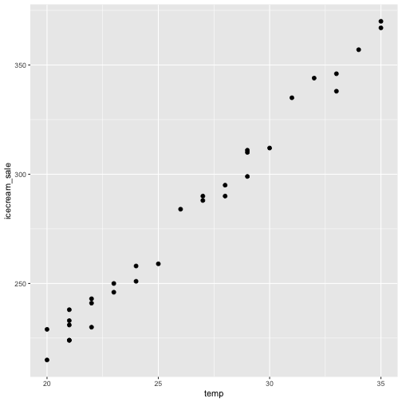
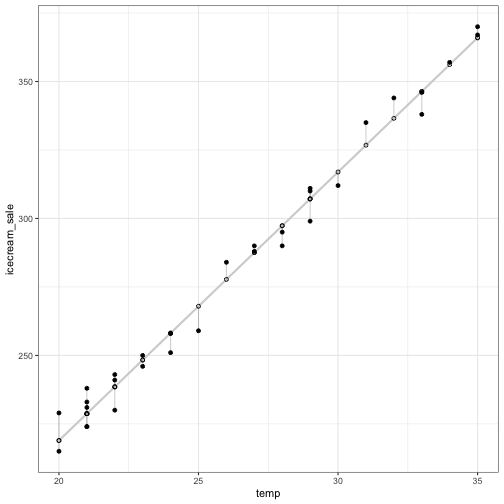

## Preamble

Picture this: Joey owns an ice cream shop. The table below is a tabulation of daily temperature in July 2018 and the number of ice creams Joey sold on each day.


```
  temp icecream_sale
1   24           258
2   21           238
3   23           246
4   34           357
5   20           229
```

### Let's plot the data!



[Figure 1](#sales-figure) brings out a pattern otherwise hidden in the data; that is, the ice cream sales seem to increase as temperature increases. Although this type of relationship is very common, it implies a profound idea[^1]; **predict the unknown based on the known**. If the relationship between ice cream sales and temperature can be established, can we predict the ice cream sales on a given day based on its weather forecast? This predict-based-on-established-relationship is the essence of regression.

## Dive deeper


```

Call:
lm(formula = icecream_sale ~ temp, data = icecream)

Residuals:
    Min      1Q  Median      3Q     Max 
-8.9390 -4.7300  0.8409  3.9454 10.0722 

Coefficients:
            Estimate Std. Error t value Pr(>|t|)    
(Intercept)  22.8831     5.7264   3.996 0.000404 ***
temp          9.8022     0.2141  45.793  < 2e-16 ***
---
Signif. codes:  0 '***' 0.001 '**' 0.01 '*' 0.05 '.' 0.1 ' ' 1

Residual standard error: 5.691 on 29 degrees of freedom
Multiple R-squared:  0.9864,	Adjusted R-squared:  0.9859 
F-statistic:  2097 on 1 and 29 DF,  p-value: < 2.2e-16
```

Let's take a look at residuals [^2]





[^1]: This is another implicit assumption when we are conducting analyses like regression; what happened in the past will happen again in the future. This is a powerful and yet risky assumption.

[^2]: I used code from this [website](https://drsimonj.svbtle.com/visualising-residuals) when generating this plot
